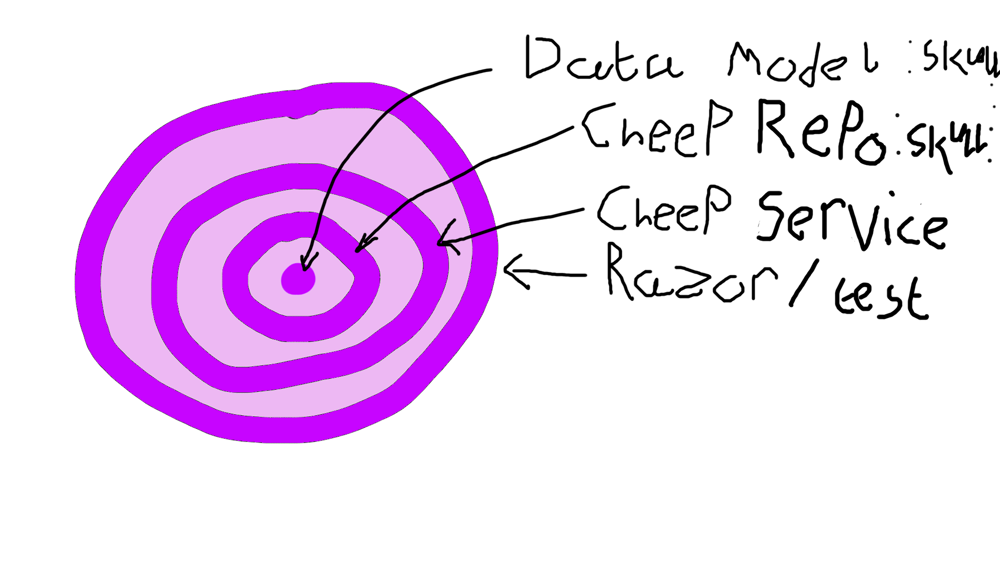
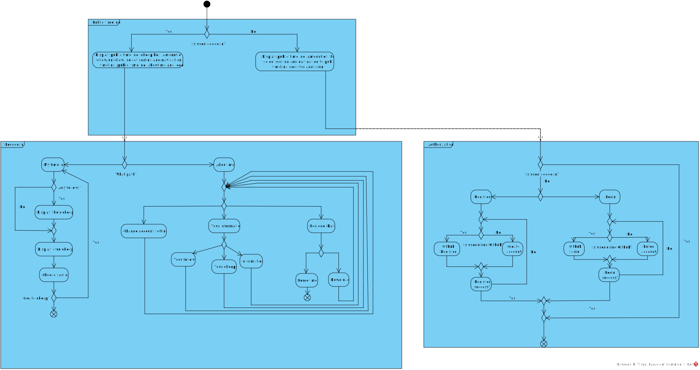

# Design and Architecture of _Chirp!_

## Domain model


Here is the domain model for our Chirp! project.

## Architecture — In the small



## Architecture of deployed application


## User activities


## Sequence of functionality/calls through _Chirp!_

# Process

## Build, test, release, and deployment


Chirp! is built, tested, released, and deployed using automated GitHub Actions workflows. We have three workflows relevant for the deployment of the Chirp! application:
- Push/PR update: Builds and tests the project, ensuring all tests pass. If anything fails, the PR is blocked.
- Push/PR merge to main: Creates a Chirp! ZIP with release configuration, which is then deployed on the Azure web app.
- Push to tag v\*.\*.\*: Creates a ZIP and adds it to release with the pushed tag. Note: this workflow runs as a matrix, creating ZIPs for Windows, macOS and Linux.

## Team work


All required features for the Chirp! project should be in place, with most features having been covered by either a unit test, integration test or end-to-end test. However, there are still some bug fixes, edge cases and other improvements to be made.

One thing that we didn't implement is checking for duplicate names when someone signs up through GitHub integration. Imagine that a user has the username "Bob". If another user signs up through the GitHub integration with a GitHub username that is also "Bob", the backend does not check if this username is already taken. This could result in a crash.

Here are some other bugs/features we didn't end up fixing/implementing:

- Have to click email confirmation otherwise it breaks the user. 
- More tests more like a pyramid. 
- Mock services for tests. 

### From issue to merge


## How to make _Chirp!_ work locally

### Before you run Chirp!
The Chirp! application supports environment variables to customize your setup. Be sure to register any needed environment variables before you run the server.

#### Setting up GitHub authentication
Chirp! supports GitHub integration via OAuth. To enable this feature, you must first [register an OAuth application on GitHub](https://docs.github.com/en/apps/oauth-apps/building-oauth-apps/creating-an-oauth-app). 

For registering the OAuth app (assuming you are hosting on `http://localhost:5000`), use the following values:
- Homepage URL: `http://localhost:5000`
- Authorization callback URL: `http://localhost:5000/signin-github`

Then you can get a client ID + client secret, which you must register in the following environment variables:
```
authentication:github:clientId=<Your Client ID>
authentication:github:clientSecret=<Your Client Secret>
```
Alternatively, if you have downloaded the Chirp! source code, you can use `dotnet user-secrets` to register them instead:
```
dotnet user-secrets set "authentication:github:clientId" <Your Client ID>
dotnet user-secrets set "authentication:github:clientSecret" <Your Client Secret>
```
Your Chirp! instance will now use your GitHub OAuth application to allow GitHub logins on the site.

#### Setting up Google authentication
Chirp! also supports Google authentication via OAuth. To enable this feature, [register an OAuth application on Google Cloud Console](https://console.cloud.google.com/).

For registering the OAuth app (assuming you are hosting on `http://localhost:5000`), add the following authorized redirect URI:
- `http://localhost:5000/signin-google`

For production:
- `https://yourdomain.com/signin-google`

Then you can get a client ID + client secret, which you must register in the following environment variables:
```
authentication:google:clientId=<Your Client ID>
authentication:google:clientSecret=<Your Client Secret>
```
Alternatively, if you have downloaded the Chirp! source code, you can use `dotnet user-secrets` to register them instead:
```
dotnet user-secrets set "authentication:google:clientId" <Your Client ID>
dotnet user-secrets set "authentication:google:clientSecret" <Your Client Secret>
```
Your Chirp! instance will now use your Google OAuth application to allow Google logins on the site.

#### Setting a custom database location
By default, Chirp! will store the database in your temporary directory as `chirp.db`. 

You can specify a custom location for the database using the environment variable `CHIRPDBPATH`. For example:
```
CHIRPDBPATH=/home/user/my-database-folder/chirp.db
```
### Running Chirp! from release builds
Chirp! is released for 64-bit versions of Windows, Mac and Linux. Releases can be downloaded [here.](https://github.com/ITU-BDSA2025-GROUP15/Chirp/releases)
#### How to run 
Depending on your operating system, the executable will have a different name (e.g. `Chirp.Web.exe` on Windows, `Chirp.Web` on Mac/Linux). In your terminal of choice, run the following:
```
./Chirp.Web
```
The Chirp! server will start. The server is ready when you see output similar to this:
```
info: Microsoft.Hosting.Lifetime[14]
      Now listening on: http://localhost:5000
info: Microsoft.Hosting.Lifetime[0]
      Application started. Press Ctrl+C to shut down.
info: Microsoft.Hosting.Lifetime[0]
      Hosting environment: Production
info: Microsoft.Hosting.Lifetime[0]
      Content root path: /Chirp
```
You can now access the Chirp! service in your browser on the following link: http://localhost:5000
### Running Chirp! from source code
#### Clone source code
1. Make sure git is installed. [Installation guide](https://git-scm.com/install/).
2. To clone the source code go to your terminal and type: `git clone https://github.com/ITU-BDSA2025-GROUP15/Chirp.git`
#### How to build Chirp!
1. Make sure you have installed .NET version 8.0. You can get it [here.](https://dotnet.microsoft.com/download/dotnet/8.0)
2. Open your terminal and navigate to the root folder of the project.
3. Run the following command: `dotnet build ./src/Chirp.Web/Chirp.Web.csproj`
4. You should now successfully have built the project.
#### How to run Chirp!
1. Begin by navigating to the Chirp.Web folder found under src in the terminal.
2. Now run the command `dotnet run`. This will start the server.
3. In your Web browser open `localhost:5273`. This will also appear in the terminal.
4. You have now opened Chirp!

## How to run test suite locally
Install playwright into the Razor.Tests project folder. 
Make sure PowerShell is installed. [PowerShell installation guide](https://learn.microsoft.com/en-us/powershell/scripting/install/install-powershell?view=powershell-7.5).
Navigate to the test project in your terminal and run the following:
```
pwsh bin/Debug/net8.0/playwright.ps1 install --with-deps
```

For further issues with Playwright, consult [Playwright.](https://playwright.dev/dotnet/docs/intro)

Now the tests can be run with the command `dotnet test`. 
# Ethics

## License
For the applications license we chose the MIT license because of its simplicity and non-restrictive nature leading to more collaboration. The MIT license is also compatible with most other licenses. To see the full [license](https://github.com/ITU-BDSA2025-GROUP15/Chirp/blob/main/LICENSE). 

## LLMs, ChatGPT, Copilot, and others
During the group's work on the application LLMs were used to a limited degree. This can be seen in the contributors tab under insights where both Copilot and CodeFactor has been attributed to a total of 25 commits. ChatGPT also has some attributions to commits, but they do not show up in GitHub insights because ChatGPT does not have a GitHub account.

CodeFactor, unlike ChatGPT and Copilot, is not an LLM, but a bot that does static analysis based on rules and therefore consumes much less power than an LLM. Although the exact numbers on how much energy and water an LLM uses is hard to figure out, due to the companies not releasing official numbers, the amount is likely high and is the reason the group only used the LLMs to a limited degree. 
CodeFactor caught many common mistakes like too many newlines or other redundancies and did improve overall code quality.

Whether the LLMs sped up or slowed down our process depended on the response gotten from the LLMs. Issue [#123](https://github.com/ITU-BDSA2025-GROUP15/Chirp/pull/123) where Copilot reduced the size of our release files without us having to research how one might do so, was an example of LLMs speeding up our process. There were also instances where the LLMs slowed down our process by leading us astray or coming up with incorrect solutions.